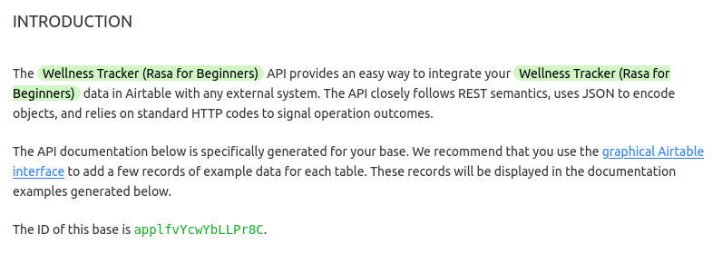

ifndef::imagesdir[:imagesdir: ./images]

= Rasa Notes

== Rasa Products

Der Rasa Stack wird in Rasa *NLU* und Rasa *Core* aufgeteilt. Diese sind so aufgebaut, dass sie unabhängig voneinander eingesetzt werden können. So besteht die Möglichkeit, nur einen Teil der Architektur auf Rasa aufzubauen und zusätzlich weitere Services mit einzubinden.

* Rasa Core

Rasa Core ist verantwortlich für den Conversation Flow, Context-Handling, Bot-Responses und Session Management. Dabei kann auf der Rasa NLU oder anderen Services aufgebaut werden, die die Intent Recognition und Entity Extraction übernehmen und die Ergebnisse dem Rasa Core zur Verfügung stellen.

RASA Core bezieht sich dabei auf die Hauptkomponente, die die Nachrichten erhält und darauf antwortet.

Der Rasa Core hält für jede Session, also für jeden User, einen *Tracker*. Dieser enthält den momentanen Zustand der Konversationen, der jeweiligen User. Bekommt der Bot nun eine Nachricht, wird zuerst der *Interpreter* durchlaufen, welcher den Originaltext als Eingabe bekommt, und die Eingabe, den Intent und die extrahierten Entities zurückgibt. Zusammen mit dem aktuellen Zustand des Trackers entscheidet die *Policy* Komponente nun, welche *Action*, also Antwort des Bots, als nächstes ausgeführt werden soll. Diese Entscheidung wird nicht durch einfache Regeln getroffen, sondern genauso wie Intents oder Entities, auf der Grundlage von einem, mit Machine Learning, trainierten Modell.

ifdef::backend-html5,backend-revealjs[image:rasa-core.png[width=80%]]

https://botfriends.de/blog/botwiki/rasa-core/

=== Policies

Der Assistent benützt Policies um zu entscheiden, welche Action als nächstes ausgeführt werden soll. Es gibt machine-learning und rule-based policies.

Hierbei kann man die Policies beispielsweise ändern. Dies macht man in der `config.yml` Datei.

https://rasa.com/docs/rasa/policies/

Bei den Policies gibt es unterschiedliche Priorities, die dann zum Einsatz kommen, wenn mehrere Policies dieselbe Confidence vorhergesagt haben.

https://rasa.com/docs/rasa/policies#policy-priority

==== TED Policy

Die TED Policy steht für Transformer Embedding Dialogue Policy und wird meistens standardmäßig verwendet.

Bei jedem Dialog bekommt die TED Policy drei Informationen als Input. Die Message des Users, die vorherige Action die vorhergesagt wurde und Slots und aktive Forms. Dann werden diese in den Dialogue Transformer Encoder gepackt und anschließend werden sogenannte Dense Layer verwendet. Danach wird die Ähnlichkeit zwischen den System Actions und dem Dialogue Embedding berechnet und zum Schluss werden noch CRF Algorithmen verwendet, um Entities zu erkennen.

https://rasa.com/docs/rasa/policies#ted-policy

* Rasa NLU

Rasa NLU hat grundsätzlich zwei Hauptaufgaben.

Zum einen wäre da die *Intent Recognition* und die *Entity Recognition*.

Die Intent Recognition, ist die Erkennung der Nutzer-Absichten. Dazu muss die NLU mit ausreichend Utterances, also Responses trainiert werden. Dabei gibt die NLU alle zugehörigen Intents geordnet nach dem Confidence Score zurück. Rasa verfügt demnach über ein Multi Intent Matching.

Außerdem gibt es noch die Entity Recognition, die dafür zuständig ist Entities, also wichtige Informationen, aus natürlicher Sprache zu extrahieren.

ifdef::backend-html5,backend-revealjs[image:rasa_nlu.png[]]

https://botfriends.de/blog/botwiki/rasa-nlu/

Der Aufbau der NLU ist vollständig konfigurierbar mithilfe der sogenannten *Pipeline*.

== NLU Pipeline

Rasa Open Source provides a default NLU config on initialization of the project.

In Rasa Open Source, incoming messages are processed by a sequence of components. These components are executed one after another in a so-called processing pipeline defined in your config.yml. Choosing an NLU pipeline allows you to customize your model and finetune it on your dataset.

Here you can see how the components and their lifecycle works:

ifdef::backend-html5,backend-revealjs[image:component-lifecycle.png[]]
https://rasa.com/docs/rasa/tuning-your-model

ifdef::backend-html5,backend-revealjs[image:pipeline.png[]]
https://www.udemy.com/course/learn-to-build-incredible-ai-chatbots-using-rasa/

You can view every component here:

https://rasa.com/docs/rasa/components

https://rasahq.github.io/rasa-nlu-examples/

=== DIETClassifier

DIET steht für "Dual Intent and Entity Transformer" der Name ist schon relativ vielsagend, DIET kann Intents klassifizieren und Entities erkennen.

Was bedeutet eigentlich Klassifizieren und was macht ein "Classifier" überhaupt?

ifdef::backend-html5,backend-revealjs[image:classifiers.png[]]

Ein Classifier nimmt den User Input und findet den passenden Intent aus unserem NLU.yml file dazu, ohne DIET würde man noch einen Entity Extractor brauchen, der aus dem Input Entities extrahiert jedoch kann DIET dies auch.

In dem Beispiel vom Bild oben würden wir dank DIET wissen wie der Intent lautet und das der Name Vincet

=== CRFEntityExtractor
ifdef::backend-html5,backend-revealjs[image:extractor.PNG[]]

=== Policy
Eine Policy sind die Techniken die beachtet werden wie der Bot dem User antwortet.

ifdef::backend-html5,backend-revealjs[image:policy.png[]]

Falls mehrere policies eine Antwort mit derselben Genauigkeit hätten, wird nach der Priorität die Antwort gewählt:

ifdef::backend-html5,backend-revealjs[image:policyPriority.PNG[]]

==== Rule Policy

Wenn man das rule.yml file und die rules die daran stehen benutzen will, muss man die Rule Policy bei den policies einstellen diese ist jedoch sowieso standard mäßig an
ifdef::backend-html5,backend-revealjs[image:rule.PNG[]]

==== TED Policy

Die TED Policy ist eine ML Policy die sich vorhergehende Aktionen ansieht, um die nächste Antwort zu bestimmen
ifdef::backend-html5,backend-revealjs[image:ted.png[]]

=== Comparing NLU Pipelines

You can compare two NLU pipelines by using this command

[source,]
----
rasa test nlu --nlu data/nlu.yml --config config_1.yml config_2.yml
----

There are two parts:

* Training

This module allows you to train models on your own data. Having your own data to train allows you to develop a NLU that is business specific.

* Server

This module serves as the training model to the chatbot. It can be hosted as an API service and runs at the back end.

The message is basically handled at two stages: one at the Core
module, which manages the conversation, and one at the NLU module,
which provides the essential language services.

ifdef::backend-html5,backend-revealjs[image:rasa-core-nlu.png[width=80%]]

**Singh, Abhishek, Ramasubramanian, Karthik, Shivam, Shrey**: Building an Enterprise Chatbot
Work with Protected Enterprise Data Using Open Source Frameworks **ISBN**: https://isbnsearch.org/isbn/9781484250341[978-1-4842-5034-1]

https://botfriends.de/blog/botwiki/rasa/

https://botfriends.de/blog/botwiki/rasa-nlu/

=== Rasa Open Source

=== Rasa Enterprise

=== Rasa X

== Installation

. Create your directory
. Install Python
. Create a virtual environment (optional but recommended)
. Install Rasa Open Source

[source,]
----
sudo apt update
sudo apt install python3-dev python3-pip python3-venv
----

Create a virtual environment (optional but recommended)

[source,]
----
python3 -m venv ./venv
source ./venv/bin/activate
----

Install Rasa Open Source

[source,]
----
pip3 install -U pip
pip3 install rasa
----

Um nun zu festzustellen, ob Rasa installiert ist kann man zum Beispiel `--version` nutzen um die installierten Version von `Rasa`, `Rasa SDK`, `Rasa X` und `Python` zu sehen.

[source,]
----
rasa --help
rasa --version

# zum Beispiel
Rasa Version      :         2.8.3
Minimum Compatible Version: 2.8.0
Rasa SDK Version  :         2.8.1
Rasa X Version    :         0.39.3
Python Version    :         3.8.8
Operating System  :         Linux-5.11.0-36-generic-x86_64-with-glibc2.10
Python Path       :         /home/lukas/anaconda3/bin/python
----

=== Additional Dependencies

Man kann bei Rasa auch andere Machine Learning Algorithmen, wie `spaCy` oder `MITIE` verwenden. Um diese zu installieren, verwendet man folgende Befehle:

- SpaCy

[source,]
----
pip3 install rasa[spacy]
python3 -m spacy download de_core_web_md
----

- MITIE

[source,]
----
pip3 install git+https://github.com/mit-nlp/MITIE.git
pip3 install rasa[mitie]
----

Oder um alle Dependencies zu installieren kann man auch optional folgenden Befehl verwenden:

[source,]
----
pip3 install rasa[full]
----

=== Conda

Conda ist ein Open-Source-Paketmanager der sowohl auf Windows, macOS und Linux läuft. Außerdem ist Conda auch ein environment manager mit dem man leicht environments erzeugen und wechseln kann, wenn man beispielsweise für eine bestimmte Anwendung eine andere Version eines Packages braucht.

In diesem Fall wurde Conda verwendet, da es beim Trainieren von Rasa Probleme und folgende Fehlermeldung beim Starten gab und ein möglicher Lösungsansatz dafür ist, dass man statt `pip` Conda verwendet.

[source,]
----
...
AttributeError: module ‘tensorflow.python.keras.engine.training’ has no attribute ‘enable_multi_worker’
----

https://forum.rasa.com/t/module-tensorflow-python-keras-engine-training-has-no-attribute-enable-multi-worker/41502

==== Installation

Falls man nach der Installation von Conda immer noch folgende Fehlermeldung bekommt, muss man noch Conda zum Path hinzufügen.

[source,]
----
conda: command not found
----

Dies macht man folgendermaßen:

[source,]
----
export PATH="/home/username/anaconda3/bin/:$PATH"
----

https://stackoverflow.com/questions/35246386/conda-command-not-found

==== Environment erstellen

Um ein Environment zu erstellen, müssen folgende Befehle ausgeführt werden:

[source,]
----
conda create --name rasa_env python=3.7
conda activate rasa_env
----

https://conda.io/projects/conda/en/latest/user-guide/tasks/manage-environments.html

Anschließend müssen Rasa und alle gewünschten Packages installiert werden

== Create the project

- To initalize to project you need to run

[source,]
----
rasa init
----

ifdef::backend-html5,backend-revealjs[image:rasa_init.png[]]

You can also use Docker for this. The only difference with this is that you'll be running Rasa inside a Docker container.

[source,]
----
docker run -v $(pwd):/app rasa/rasa:2.8.0-full init --no-prompt
----

- After that you can open the project in your preferred IDE.

- To start a server with your trained model you use

[source,]
----
rasa run
----

== Train your bot

=== Add new intents

Intents are stored in the `data/nlu.md` file.
The syntax to create a new intent is as following:

[source,]
----
## intent:<intent name>
- <phrase 1>
- <phrase 2>
- <phrase 3>
----

If you're using a newer version of Rasa you'll have a `nlu.yml` file insead

[source,]
----
- intent: <intent name>
  examples: |
    - <phrase 1>
    - <phrase 2>
    - <phrase 3>
----

Now to identify these new intents you have to add them to the list found
in your `domain.yml` file.

[source,]
----
intents:
  - greet
  - goodbye
  - affirm
  - deny
  - mood_great
  - mood_unhappy
  - bot_challenge
  - <your newly created intent>
  ...
----

=== Add responses

To add responses the chatbot should give go to the `domain.yml` file. 
The syntax for adding a new response looks like this:

[source,]
----
responses:
  utter_greet:
  - text: "Hey! How are you?"
  
  utter_<name of your response>:
  - text: "<text>"
    image: ""
  ...
----

=== Create stories

To use your created intents and responses you have to define so-called 
`stories` in your `data/stories.yml` file.

The syntax for markdown looks like this:

[source,]
----
## <name of your story>
* <name of the intent that is triggered>
  - <response that should be provided>
----

And this is the syntax for yml files:

[source,]
----
- story: <name of your story>
  steps:
    - intent: <name of the intent that is triggered>
    - action: <response that should be provided>
    - intent: <name of the intent that is triggered>
    - action: <response that should be provided>
    ...
----

=== Run your new stories

Um das neue Model zu nutzen muss man dieses zuerst neu trainieren. Dies ermöglicht es dem Model alle neuen Dinge, die wir gerade implementiert im `data/stories.yml` und `domain.yml` File zu lernen.

Um sein Model zu trainieren benützt man folgenden Befehl:

[source,]
----
rasa train
----

Um alle Optionen und Flags für den Trainingscommand zu erfahren kann man sich `--help` zur Hilfe nehmen.

[source,]
----
rasa train --help
----

Danach kann man den Server starten und eine neue Chat-Session starten, indem man den `rasa shell` nützt.

[source,]
----
rasa shell
----

Now you can start asking your bot your new defined questions. Keep in mind that the text doesn't have to be exactly like you wrote it and that the assistant will still be able to recognize it even with a few differences.

ifdef::backend-html5,backend-revealjs[image:rasa_shell.png[]]

=== Andere CLI Befehle

Um eine interaktive Lernsession mit dem Bot zu starten, verwendet man den Befehl `rasa interactive`. Dabei wird einem in der Konsole ständig angezeigt, wie der Bot nun reagieren würde und man kann ihm direkt Feedback geben, ob die folgende Aktion richtig oder falsch ist.

[source,]
----
rasa interactive
----

ifdef::backend-html5,backend-revealjs[image:rasa-interactive.png[]]

== Komponenten

=== Intents

`Intents` sind die Absichten hinter der Nachricht des Benutzers. Als Intents werden also alle möglichen Beispielssätze definiert, die
ein Benutzer sagen könnte um eine bestimmte Absicht auszudrücken.

`Intents` werden in dem `nlu.yml` File wie folgt angegeben:

[source,]
----
## intent:<intent name>
- <phrase 1>
- <phrase 2>
- <phrase 3>
----

=== Responses

`Responses` sind die Antworten, die vom Bot gegeben werden, wenn ein bestimmter `Intent` erkannt wurde.

`Responses` fügt man in seinem `domain.yml` File wie folgt ein:

[source,]
----
responses:
  utter_greet:
  - text: "Hey! How are you?"

  utter_<name of your response>:
  - text: "<text>"
    image: ""
  ...
----

=== Slots

Slots are the bot's memory. They are key-value pairs and can be used to store information the user provided, similar to entities, like locations or information about the outside world.

In this example we are using slots for a form. 

The syntax for creating a slot inside the `domain.yml` file is as follows:

[source,]
----
slots:
  slot_name: <slot name>
    type: <type>
----

=== Entities

Entities are structured pieces of information inside a user message like for example a location or a job or a name.

In your `domain.yml` file you write:

[source,]
----
entities:
  - <entity name>
  - <entity name>
----

Um die Entities in den Intents anzugeben, verwendet man folgende Syntax:

[source,]
----
Hallo mein Name ist [Lukas](name).
Ich hätte gerne eine [große](size) [Pizza](meal)
----

==== Entity Roles

Um die Entities in den Intents anzugeben, verwendet man folgende Syntax:

[source,]
Entity Roles können sinnvoll in manchen Szenarien sein. Zum Beispiel bei folgendem Satz:

[source,]
----
Buche einen Flug von [Linz](city) nach [London](city).
----

In diesem Fall sind sowohl `Linz` als auch `London` zwar richtig gekennzeichnet als `city` Entity, allerdings reicht
diese Information noch nicht aus, damit der Chatbot richtig reagieren kann.

Hierbei wäre es praktisch, wenn man noch angibt, welche dieser zwei Städte das Ziel und welche der Abflugsort ist.

Um die Entities in den Intents anzugeben, verwendet man folgende Syntax:

[source,]
Dies macht man mit `Entity Roles`.

==== Entity Groups

`Entity Groups` können genutzt werden, wenn man Entites miteinander gruppieren möchte.

Dies kann zum Beispiel hier sinnvoll sein:

[source,]
----
Ich hätte gerne eine große [Pizza](meal) mit [Pilzen](topping) und eine [Salami](topping) [Pizza](meal).
----

Bei der Gruppe muss hier erkannt werden, welche zwei Entites zusammen gehören:

[source,]
----
Ich hätte gerne eine große [Pizza](meal) mit [Pilzen](topping) und eine [Salami](topping) [Pizza](meal).
Group 1: [Pizza](meal) [Pilzen](topping)
Group 2: [Salami](topping) [Pizza](meal)
----

==== Nutzung von Entity Roles und Entity Groups

TIP: Um diese Features nutzen zu können muss in der `Pipeline` entweder der `CRFEntityExtractor` oder der `DIETClassifier`
verwendet werden, da diese als einzige Entity Extractors role und group labels erkennen können.

Man kann entweder ein `Form` verwenden oder eine `Custom Action` machen um `Entity Roles` und `Entity Groups` zu verwenden.

https://rasa.com/blog/introducing-entity-roles-and-groups/

=== Actions

Es gibt 2 verschiedene Arten von Messages:

1. Static Messages: Diese sind unabhängig vom User Input und benötigen keinen Action Server
2. Dynamic Messages: Diese sind abhängig vom User Input und benötigen einen Action Server

Der <<rasa_action_server>> führt sogenannte Custom Actions für einen Rasa Open Source Conversation assistent aus.

Wenn dein Assistant eine gewisse Custom Action vorhersagt, sendet der Rasa Server einen POST request an den Actionserver mit einer JSON Payload mit dem Namen der vorhergesagten Action, der Conversation ID, den Inhalten des Trackers und den Inhalten der Domain.

=== Forms

Um mehrere Informationen von einem Benutzer zu bekommen eignen sich Forms.

TIP: Um Forms zu verwenden, muss die `RulePolicy` in der Policy Konfiguration eingetragen sein.

Um ein Formular hinzuzufügen, muss man dies in der `forms` Section in dem `domain.yml` File angeben.

[source,]
----
forms:
  restaurant_form:
    required_slots:
        cuisine:
          - type: from_entity
            entity: cuisine
        num_people:
          - type: from_entity
            entity: number
----

https://rasa.com/docs/rasa/forms/

=== Synonyms

Mithilfe von Synonymen kann man extrahierten Entities einen anderen Wert geben, als sie eigentlich vorher hatten, wenn diese
in der Bedeutung gleich sind. Wenn man also mit verschiedenen Wörtern dasselbe meint, kann man sich `Synonyms` zur Hilfe nehmen.

Ein Beispiel dafür wäre Folgendes:
----
nlu:
- synonym: credit
  examples: |
    - credit card account
    - credit account
----

https://rasa.com/docs/rasa/nlu-training-data/#synonyms

=== Rules

Rules werden angegeben um kleine Teile von Unterhaltungen anzugeben, die immer wieder gleich behandelt werden sollen.

Rules sollten allerdings nicht allzu häufig verwendet werden, weil man nie alle Konversationen vorhersagen kann.

TIP: Um Rules zu verwenden, muss die `RulePolicy` in der Policy Konfiguration eingetragen sein.

Um eine Rule zu verwenden, schreibt man folgendes in sein `rules.yml` File:

----
rules:

- rule: Say `hello` whenever the user sends a message with intent `greet`
  steps:
  - intent: greet
  - action: utter_greet
----

https://rasa.com/docs/rasa/rules

== Rasa Action Server [[rasa_action_server]]

Es gibt 2 verschiedene Arten von Messages:

1. Static Messages: Diese sind unabhängig vom User Input und benötigen keinen Action Server
2. Dynamic Messages: Diese sind abhängig vom User Input und benötigen einen Action Server

Der Rasa Actionserver führt sogenannte Custom Actions für einen Rasa Open Source Conversation assistent aus.

Wenn dein Assistant eine gewisse Custom Action vorhersagt, sendet der Rasa Server einen POST request an den Actionserver mit einer JSON Payload mit dem Namen der vorhergesagten Action, der Conversation ID, den Inhalten des Trackers und den Inhalten der Domain.

=== Running the Rasa SDK Action Server

Es gibt zwei verschiedene Arten, um den Actionserver zu starten. Diese sind abhängig davon, ob man `rasa` installiert hat oder nicht.

Wenn man rasa installiert hat, kann man folgenden Befehl nützen:

[source,]
----
rasa run actions
----

Oder sonst sollte man folgenden Befehl benützen:

[source,]
----
python -m rasa_sdk --actions actions
----

We are now running two servers, one for `Rasa Open Source` and the `Rasa Action Server`.

== Airtable

For the tutorial `Rasa for Beginners` on Udemy we used a template for an Airtable workspace.

You need to define three keys when working with Airtable. 

The `API_KEY` which is obtained on your `/account` page.

ifdef::backend-html5,backend-revealjs[image:api_key.png[width=80%]]

Your `BASE_ID` which you when you're in your `API Docs`. And the 
`TABLE_NAME` which you'll also get there.

Now export your keys in a `.env.sh` and `.env` file.

Note that the `TABLE_NAME` uses HTML to encode the name and `%20` is for the space character.

[source,]
----
export AIRTABLE_API_KEY=key***
export BASE_ID=app***
export TABLE_NAME=Table%201
----

To keep our credentials separate from other code we'll use `python-dotenv`. You install it through:

[source,]
----
pip install python-dotenv
----

Now to run the action server you use:

[source,]
----
rasa run actions
----

And in another terminal you start `Rasa Open Source` through:

[source,]
----
rasa shell
----

Now after you've taken part in the survey a new line in your Airtable will be inserted

ifdef::backend-html5,backend-revealjs[image:airtable-new.png[]]

== Twilio

=== Ngrok

To connect to Twilio we'll have to use this tool, which simulates hosting a system to a server. It creates a tunnel URL.

To install Ngrok use:

[source,]
----
sudo snap install ngrok
----

After that connect Ngrok to your account through

[source,]
----
ngrok auththoken <your token>
----

Then you can use Ngrok to create a tunnel for you. In this case
we want it for the `http port 5005`.

Note that this URL is only temporary and you always have to restart it when you want to use it.

[source,]
----
ngrok http 5005
----

In the `Rasa for beginners` course we connect to Twilio, which provides developer-friendly APIs for text messages.

At first you have to register for an account.

In your `credentials.yml` file you can now save the data of Twilio.

[source,]
----
twilio:
  account_sid: "<your SID>"
  auth_token: "<your token>"
  twilio_number: "<your twilio number>"
----

Now you need to restart Rasa through 

[source,]
----
rasa run
----

Also Ngrok should be running and you have to insert your URL
into Twilio.

ifdef::backend-html5,backend-revealjs[image:twilio-ngrok.png[]]

Now you can chat with your assistant via SMS.

ifdef::backend-html5,backend-revealjs[image:chat-twilio.jpeg[width=30%]]

ifdef::backend-html5,backend-revealjs[image:chat-info.jpeg[width=30%]]

== Conversation-Driven Development CDD

Conversation-Driven Development is the process of listening to your users and using those insights to improve your AI assistant. 

The way we wrote phrases that the user might come up with doesn't 
connect to the real world. People are different in the way that
they phrase something based on their age, background and other factors.

Also there's the "curse of knowledge" which means that we know our
application well and we know how to phrase something in order
to get the correct answer but other people don't have that. 
So in other words we can't imagine how an user who doesn't know
something might use the bot.

It is really important that you test your application with real
world people even though it might feel uncomfortable at first.

There are 6 factors of CDD:

1. Share
2. Review
3. Annotate
4. Test
5. Track
6. Fix

== Rasa X

- Layers on top of Rasa Open Source and helps you build a better assistant
- Can be deployed anywhere, so your training data stays secure and proprietary
- Runs in the browser
- Let's you talk to your bot
- Helps to correct model predictions
- Share your application with test users
- Review conversations
- Annotate user messages

In the process of `Deployment` you expose your application to a
server rather than still using it locally. 

=== Installation

Es gibt verschieden Arten, um Rasa X zu installieren.

==== Local Mode

Um Rasa X lokal zu installieren, verwendet man folgenden Befehl:

[source,]
----
pip3 install rasa-x --extra-index-url https://pypi.rasa.com/simple
----

==== Troubleshooting

Dies kann allerdings zu Problemen führen, bei denen die Installation stockt und nie beendet wird. Dies liegt daran, dass in pip 20.3 obenstehendes nicht funktioniert. Man kann also entweder eine ältere Version verwenden oder einstellen, dass noch die alte Logik verwenden sollte.

[source,]
----
INFO: pip is looking at multiple versions of sniffio to determine which version is compatible with other requirements. This could take a while.
----

https://forum.rasa.com/t/rasa-x-install-stucked/39640

https://stackoverflow.com/questions/65806524/pip-install-rasa-x-takes-forever/65812957#65812957

Außerdem kann es immer noch zu Problemen mit den Versionen der verschiedenen Packages und Rasa X kommen. In folgenden Links werden Beispiele dafür und die Lösungen für diese Probleme geschildert.

https://forum.rasa.com/t/rasa-x-dont-work/46931/9

https://forum.rasa.com/t/rasa-x-0-23-0-error-in-endpoints-yml/21744/4

Um Rasa X nun zu starten, verwendet man folgenden Befehl:

[source,]
----
rasa x
----

Dieser öffnet einen Browser Tab unter der Adresse `http://localhost:5002`.

==== Mit Docker Compose

Rasa stellt zwei verschiedene Anleitungen zur Verfügung, um Rasa X auf einem Server als Set von Docker Containern zu erstellen. 

1. Mithilfe eines Install Scripts 

https://rasa.com/docs/rasa-x/installation-and-setup/install/docker-compose/#docker-compose-install-script

2. Manuell

https://rasa.com/docs/rasa-x/installation-and-setup/install/docker-compose/#docker-compose-manual-install

https://forum.rasa.com/t/rasa-x-production-server-is-giving-error-as-could-not-launch-runtime/38058

https://rasa.com/docs/rasa-x/changelog/compatibility-matrix/

https://forum.rasa.com/t/i-cant-login-to-rasa-x/31726/8

https://stackoverflow.com/questions/64678048/getting-error-when-set-rasa-x-admin-password-with-default-command

https://rasa.com/docs/rasa-x/changelog/rasa-x-changelog

https://rasa.com/docs/rasa/changelog

=== Production

In Rasa X kann man seinen Bot mit Gästebenutzern teilen, die dann mit dem Bot chatten können und so bei der Verbesserung einen wichtigen Teil beitragen können.

Dafür klickt man auf den Share-Button und gibt dann einen Namen und eine Beschreibung ein.

ifdef::backend-html5,backend-revealjs[image:share-bot.png[width=80%]]

Dieser Link funktioniert allerdings nur lokal und verweist auf den `localhost`

==== Ngrok

Dafür kann man `Ngrok` beispielsweise verwenden.

[source,]
----
ngrok http 5002
----

== Troubleshooting

=== Port 5005 already in use

If you're having trouble with `rasa init` because the port `5005` is already in use try to find the process, that is listening on this port, and kill it for example like this:

[source,]
----
lsof -i -P -n | grep LISTEN
kill <id of process>
----

ifdef::backend-html5,backend-revealjs[image:kill_process.png[]]

=== Rasa: command not found

This could be because pip, pip3 and pip3.8 are all installed in `/home/user/.local/bin` which is not in the PATH. In order to fix this you have to export this path to to the path variable.

[source,]
----
export PATH="$HOME/.local/bin:$PATH"
----

== Links

Links used for this documentation are:

https://www.udemy.com/course/rasa-for-beginners/

https://blog.rasa.com/conversation-driven-development-a-better-approach-to-building-ai-assistants/

https://rasa.com/docs/rasa/

https://rasa.com/docs/rasa/docker/building-in-docker/

https://rasa.com/docs/rasa/tuning-your-model

https://rasa.com/docs/rasa/components

https://rasahq.github.io/rasa-nlu-examples/

Singh, Abhishek, Ramasubramanian, Karthik, Shivam, Shrey: Building an Enterprise Chatbot
Work with Protected Enterprise Data Using Open Source Frameworks **ISBN**: [978-1-4842-5034-1]

https://forum.rasa.com/t/module-tensorflow-python-keras-engine-training-has-no-attribute-enable-multi-worker/41502

https://www.udemy.com/course/learn-to-build-incredible-ai-chatbots-using-rasa/
